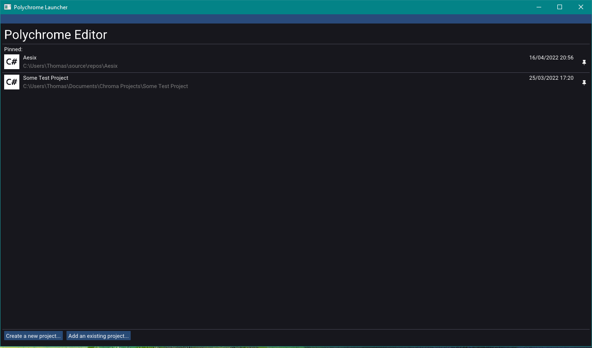
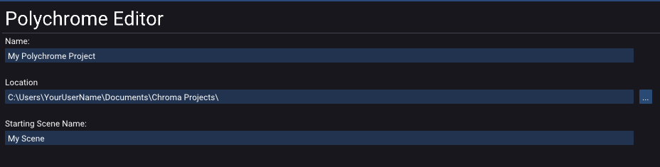

# Creating a Project

Once you launch `Polychrome.exe`, you should see the launcher:

The launcher shows a list of all existing projects on your system. By default the list should be empty.

To create a new project, click **Create a new project**.

Fill in the details and click **Create**.
From here the new project should load, and you should see the main editor window.
