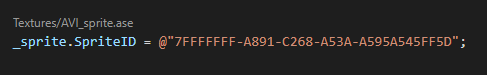
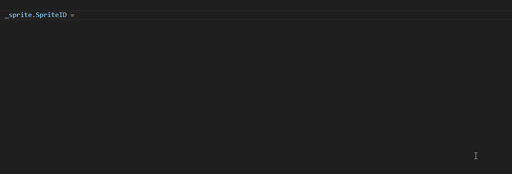

# VSCode Extension

The engine comes with a simple VSCode extension for making development in the Chroma Engine and Polychrome Editor a little easier.

## Installation
- Requires VSCode to be installed
- In the Polychrome Editor, click **Options** > **Install VSCode Extension**.

Note: If this option does not exist, the engine could not detect VSCode in the PATH. Either add to the path, or reinstall.

## Features

- Asset Code Lens
  
  
  
  This allows the user to view the name/path of the asset when referencing a GUID. Clicking on the path will highlight it in the VSCode Explorer.

- Asset GUID Completion
  
  
  Typing the `@` character will provide asset path completion suggestions. Hitting `Enter` will substitute the selected path with it's GUID.
